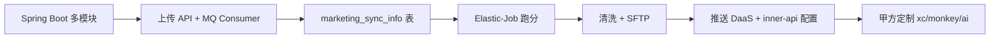

# 技术学习路线 — Marketing 营销平台

按 **P0（必须先会）→ P1（负责功能必备）→ P2（深化与定制）** 排列；「模块 #」对应《项目分析.md》核心功能模块表。

---

## P0 — 入职第一周

| 技术/能力 | 为何在本项目 | 学什么 | 代码锚点 | 模块 # |
|-----------|--------------|--------|----------|--------|
| Java 17 + Spring Boot 2.7 | 全栈基础 | IoC、配置多环境、`@RestController` | 各模块 `*Application.java` | — |
| Maven 多模块 | 依赖 cs/utils | 父 POM、模块边界、打包部署单元 | 根 `pom.xml` `<modules>` | — |
| MyBatis + 实体 | 所有持久化 | Mapper XML、Example、分页 | `marketing-cs/.../mapper/` | #7 |
| RocketMQ 消费模型 | 主异步链路 | Topic/Tag、并发消费、重试 | `BaseMqMessageListener`、`MarketingPreUserReceiveConsumer` | #7–#12 |
| Redis | 缓存、开关、发号 | Lettuce 配置、Key 规范 | `resources/*/redis.yml` | — |
| apiCode 业务概念 | 配置主键 | Customer 与客户隔离 | `CustomerMapper`、`CustomerController` | #13 |

**建议顺序**：Spring Boot 多模块 → 跟读上传 API → 跟读一个 Consumer → 看一张核心表 `marketing_sync_info`。

---

## P1 — 第二～四周（能改需求）

| 技术/能力 | 为何在本项目 | 学什么 | 代码锚点 | 模块 # |
|-----------|--------------|--------|----------|--------|
| Elastic-Job | 200+ 定时任务 | `AbstractSimpleElasticJob`、`JobParameter`、分片 | `TaskScoreStartJob`、`SftpToDbByCommonJob` | #3、#20 |
| 跑分业务 | 核心产出 | 任务状态、暂停恢复 | `TaskScoreServiceImpl`、`TaskActionJob` | #3–#6 |
| 数据清洗 | 定制上传必备 | 规则配置、线程池批处理 | `DataCleanServiceImpl` | #17–#19 |
| SFTP 文件 | 大量甲方 | 拉取、推送、分片 Job | `GetFromSftpJob`、`PutToSftpJob`、`SftpToDbByResultDataJob` | #20–#24 |
| 推送规则 | 过滤与下发 | PushRule、转化推送 | `PushRuleService`、`PushRuleFilterController` | #15、#27 |
| 对内 API | 运营配置 | 鉴权、Swagger | `marketing-inner-api/.../controller/` | #13–#16 |
| 告警与埋点 | 排障 | `AlarmApiClient`、`TrackingService` | `common` 包 AlertLog | #36、#65 |
| Fastjson / DTO | 接口体量大 | 与甲方 JSON 协议 | `MarketingPreUserDTO`、`UploadDataDTO` | #1 |

**建议顺序**：Elastic-Job 控制台与配置 → 跑分链路 → 清洗一条 Job → SFTP 一个 bridge Job。

---

## P2 — 第二月起（定制与优化）

| 技术/能力 | 为何在本项目 | 学什么 | 代码锚点 | 模块 # |
|-----------|--------------|--------|----------|--------|
| Aviator 表达式 | 规则引擎 | 表达式与配置绑定 | `aviator` 依赖、规则清洗相关 Service | #18 |
| Elasticsearch 7.x | 部分客户 ES 清洗/查询 | 索引写入、周期 Job | `ToEsRetryDataJob`、`RsUpdateEsDataCycleJob` | #69 |
| RabbitMQ | 部分模块辅助队列 | 与 Rocket 并存原因 | 各模块 `RabbitMqConfig.java` | — |
| Pulsar | 遗留/补充消费 | Consumer 初始化 | `PulsarConsumerInitCommandLineRunner` | #70 |
| gRPC 客户端 | 调内部 BR 服务 | 配置与 Stub | `br_grpc_client.properties` | #27 |
| 携程/同程专线 | 复杂撞库 | 多 Consumer、补偿 Job | `marketing-xc-consumer`、`TcCpa*Job` | #43–#46 |
| AI 专线 | 预用户与下行 | 多 Topic 分片 | `marketing-ai-mq-consumer`、`AiUniversalReceive*` | #59–#60 |
| PageHelper | 大表分页 | 避免 OOM | 清洗/查询 Job 分页模式 | #18 |
| Prometheus | 接口耗时 | `@PrometheusTimeMethod` | `MarketingUserPreController` | #1 |
| Istio 多环境配置 | 线上部署 | pre/prod-istio 配置差异 | `resources/prod-istio/` | §9 |

---

## 建议学习顺序（路径图）

---

## 按部署应用拆的阅读清单

| 应用 | 先读什么 |
|------|----------|
| marketing-api | `MarketingUserPreController`、`MarketingTransferDataController` |
| marketing-mq-consumer | `consumer/rocketmq` 包下 PreUser/Transfer |
| marketing-task | `TaskScoreStartJob`、`TaskScoreServiceImpl` |
| marketing-check | `ResultCheckJob`、`RetryCommonServiceJob` + `consumer/rocketmq` |
| marketing-inner-api | `CustomerController`、`DataCleanConfigController`、`auth/*` |
| marketing-cs | `PushRuleService`、`DataCleanServiceImpl`、`CustomerUploadDataService` |
| marketing-data-bridge | `job/SftpToDb*`、`job/tccpa/*` |
| marketing-data-monkey | `job/wuba`、`job/didi`、`job/xiecheng` 任选一个客户跟进 |

---

## 不建议首轮深挖

- `mybatis-generator`（生成器，非业务）
- 大量 `TestSre`、`Mock*` 控制器（运维/测试）
- 全量 200+ Job 类名背诵（按客户包定位即可）

---

## 自检（能否独立改一个小需求）

- [ ] 能说出上传从 Controller 到哪张表、经过哪个 Consumer  
- [ ] 能新建/修改一个 Elastic-Job 并在配置中心注册（> 需确认 公司 Job 平台名）  
- [ ] 能解释主 Topic 与应急 Topic 的使用场景  
- [ ] 知道改清洗逻辑动 `DataCleanServiceImpl` 而非 Controller  
- [ ] 知道甲方定制优先去 `data-monkey` / `xc-*` 而非改 api 通用接口
