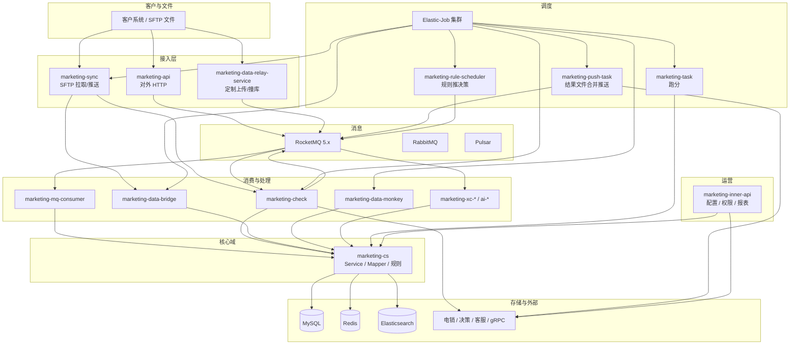

# Marketing 营销平台 — 项目分析

## 1. 项目定位

**Marketing** 是一套面向金融/营销场景的 **多租户智能营销与数据运营平台**（Maven 多模块、Spring Boot 2.7、Java 17）。核心能力包括：

- **客户侧数据接入**：HTTP 上传原始人群、标准/定制转化回传、撞库与黑名单等；
- **数据清洗与规则引擎**：按客户 `apiCode`、场景、Aviator/规则配置做清洗、去重、分流；
- **跑分（评分）任务**：Elastic-Job 调度批量评分，结果落库并校验；
- **结果下发**：经 RocketMQ / SFTP / 外部 DaaS（电销、决策、客服等）推送；
- **大量甲方定制**：同程、携程、58、滴滴、数禾、海尔、众安、奇富等独立 Job/API/消费链路。

对外以 `marketing-api`、`marketing-data-relay-service` 等暴露接口；对内以 `marketing-inner-api` 做配置与运营；异步以 `marketing-mq-consumer`、`marketing-check` 等分担。

---

## 2. 整体架构

**模块依赖关系（简化）**：各可部署应用均依赖 `marketing-cs`（实体、Mapper、业务 Service）与 `marketing-utils`（工具）；`mybatis-generator` 仅用于代码生成，非运行时。

---

## 3. 核心功能模块一览

| # | 名称 | 作用 | 部署应用 | 入口 | 表 / Topic（代表） |
|---|------|------|----------|------|-------------------|
| 1 | 营销人群批量上传 | 客户加密上传预营销人群，异步入库 | marketing-api → mq | `POST /marketingUserPre/receiveMarketingPreUser` | `marketing_sync_info`、MQ `MarketingUploadConstants` |
| 2 | 转化数据回传 | 标准转化、定制转化写入并触发下游 | marketing-api | `/marketingTransferData/*` | 转化相关表、MQ 转化 Topic |
| 3 | 跑分任务调度 | Elastic-Job 拉取待跑分任务执行评分 | marketing-task | `TaskScoreStartJob` | `marketing_task` |
| 4 | 跑分任务控制 | 暂停/恢复跑分程序与单任务 | marketing-task | `TaskActionJob` | `marketing_task` |
| 5 | 跑分任务构建 | 根据配置生成跑分任务 | marketing-task | `BuildTaskJob` / `BackBuildTaskJob` | `marketing_task` |
| 6 | 跑分结果校验 | 校验跑分产出文件/记录 | marketing-check | `ResultCheckJob` | 跑分结果表 |
| 7 | 上传数据 MQ 消费 | 预用户主链路落库 | marketing-mq-consumer | `MarketingPreUserReceiveConsumer` | `marketing_sync_info` |
| 8 | 上传应急队列 | 高优先级上传消费 | marketing-mq-consumer | `MarketingPreUserReceiveEmergencyConsumer` | 同上 |
| 9 | 上传小流量队列 | 小批量上传隔离 | marketing-mq-consumer | `MarketingPreUserReceiveSmallConsumer` | 同上 |
| 10 | 数禾专用上传消费 | 数禾场景上传 | marketing-mq-consumer | `MarketingPreUserShuHeConsumer` | 数禾相关 |
| 11 | 转化 MQ 消费 | 转化数据主消费 | marketing-mq-consumer | `MarketingTransferReceiveConsumer` | 转化表 |
| 12 | 转化应急/小流量 | 转化优先级与隔离 | marketing-mq-consumer | Emergency/Small Consumer | 转化表 |
| 13 | 客户配置与跑分规则 | Customer、跑分/资源/产品/排他规则 CRUD | marketing-inner-api | `CustomerController`、`RuleOfScoreController` 等 | `customer`、`rule_*` |
| 14 | 快速任务规则 | FastTask 规则配置 | marketing-inner-api | `FastTaskRuleContronller` | 快速任务配置表 |
| 15 | 推送规则过滤 | PushRuleFilter 规则中心 | marketing-inner-api / api | `PushRuleFilterController` | 推送过滤配置 |
| 16 | 同步配置与报表 | 同步任务配置、上传/转化报表 | marketing-inner-api | `SyncConfigController`、`SyncReportController` | `marketing_sync_*` |
| 17 | 数据清洗配置与任务 | 清洗规则、清洗任务管理 | marketing-inner-api | `DataCleanConfigController`、`DataCleanTaskController` | `marketing_data_clean_*` |
| 18 | 通用数据清洗 Job | 按规则批量清洗原始数据 | marketing-check | `DataCleaningGeneralJob`、`CustomUploadDataCleanJob` | `marketing_customer_original_data` |
| 19 | 清洗文件 SFTP 同步 | 清洗文件拉取与同步 | marketing-check | `DataCleanFileSyncJob` | 清洗文件表 |
| 20 | SFTP 通用入库 | 通用文件读入落表 | marketing-data-bridge | `SftpToDbByCommonJob` | 各业务原始表 |
| 21 | SFTP 电销结果入库 | 电销结果文件入库 | marketing-data-bridge | `SftpToDbByResultDataJob` | 结果/电销表 |
| 22 | SFTP 转化入库 | 转化类文件入库 | marketing-data-bridge | `SftpToDbByDxTransferDataJob` 等 | 转化表 |
| 23 | 文件转化落 SFTP | 转化数据生成文件推客户 | marketing-data-bridge / check | `TransferFileTaskJob` | 文件任务表 |
| 24 | 客户 FTP 文件同步 | 从客户 FTP 拉到内部、反向推送 | marketing-sync | `GetFromSftpJob`、`PutToSftpJob` | 同步配置 |
| 25 | 离线结果文件合并推送 | 跑分/预警结果合并推内部 SFTP | marketing-push-task | `UpdateFileJob` + MQ Merge | 推送任务文件表 |
| 26 | 推送合并 MQ | 文件分片合并触发 | marketing-push-task | `MarketingPushTaskFileMergeConsumer` | MQ `MarketingAssistConstants` |
| 27 | 推送电销 DaaS | 转化/评分推电销 | marketing-check | `MarketingPushDaasTransferConsumer` 等 | MQ `MarketingOutsideInterfaceConstants` |
| 28 | 推送黑名单 | 黑名单同步下游 | marketing-check / inner-api | `MarketingPushBlackConsumer` | 黑名单表 |
| 29 | 推送客服智能营销 | 客服侧推送与状态查询 | marketing-inner-api | `ZnkfPushController` + 相关 Consumer | 客服推送表 |
| 30 | 规则调度推决策 | 按规则周期推决策系统 | marketing-rule-scheduler | `ToPolicyByRuleJob`、`AutomatedPushDecisionJob` | 规则调度配置 |
| 31 | 有效期重发 | 营销有效期到期重发 | marketing-rule-scheduler / check | `ValidPeriodResendJob` | 有效期相关 |
| 32 | 客户推送状态查询 | 轮询客户侧推送状态 | marketing-rule-scheduler | `CustomerPushStatusQueryJob` | 推送状态表 |
| 33 | 标签计算 | 标签数据源计算落库 | marketing-check | `CalculateTagDataJob` | `tag_*` |
| 34 | 数据分组处理 | DataGroup 分组逻辑 | marketing-check | `DataGroupHandlerJob` | 数据分组表 |
| 35 | BI 报表 | 内部 BI 报表转换与邮件 | marketing-inner-api | `BiReportController`、`StatisticsEmailController` | BI 相关表 |
| 36 | 埋点与链路追踪 | 数据流向上报 Tracking | marketing-cs | `TrackingService`、各 Job 埋点 | 埋点日志 |
| 37 | 权限与资源 | 用户、角色、资源、验证码 | marketing-inner-api | `auth/*Controller` | `marketing_user_info_*` |
| 38 | 客户策略 | 客户维度策略配置 | marketing-inner-api | `CustomerStrategyController` | 策略表 |
| 39 | LinkGo 任务 | 外链/任务编排 | marketing-inner-api | `MarketingLinkGoController` | LinkGo 相关 |
| 40 | 变量分配与字典 | 营销变量配置 | marketing-inner-api | `VariableAllocationController`、`VariableDicController` | 变量表 |
| 41 | 模板与 JSON 解析 | 上传模板、JSON 解析配置 | marketing-inner-api | `TemplateController` | 模板表 |
| 42 | 汽车线索 | 车线索渠道、上报、清洗 | inner-api + data-monkey + relay | `CarClue*`、`HxCarClueController` | 车线索表 |
| 43 | 同程 CPA 撞库 | 同程 CPA 撞库采集、过滤、文件 | data-bridge + sync + inner-api | `TcCpa*` Job/Controller | `tc_cpa_*` |
| 44 | 同程运营同步 | 同程运营名单推送客户 | data-monkey | `TongChengOperationPushToCustomerJob` | 同程同步表 |
| 45 | 携程撞库与 CPS | 携程撞库、CPS、循环重试 | xc-general / xc-loop-cycle / xc-consumer | `XieCheng*` Job/Consumer | `xiecheng_*` |
| 46 | 携程报表消费 | 多 Topic 报表回传消费 | marketing-xc-consumer | `MarketingXieChengReportConsumer` A~E | 报表 Topic |
| 47 | 58 撞库与转化 | 58 撞库提交、查询、转化变更 | data-monkey + mq-consumer | `WuBa*` Job/Consumer | 58 相关表 |
| 48 | 滴滴 V5 撞库 | 滴滴撞库采集与回调 | data-monkey + mq-consumer | `DidiV5*`、`DiDiV5CollidingDataConsumer` | 滴滴表 |
| 49 | 得物撞库 | 得物撞库下发 | data-monkey | `DewuCollidingDataToSendJob` | 得物表 |
| 50 | 众安 roster | 众安名单锁定推送 | data-monkey | `ZhongAnPushRosterLockingDataJob` | 众安表 |
| 51 | 众邦语音/标签 | 众邦 AI 语音、财富标签 | data-monkey + check | `ZhongBang*` Job | 众邦表 |
| 52 | 奇富触达/清洗 | 奇富多场景 Job 与清洗 | data-monkey + check | `QiFu*` Job | 奇富表 |
| 53 | 友盟设备与策略 | 友盟定时任务、调策略 | data-monkey | `UMeng*` Job | 友盟表 |
| 54 | 云客设备类型 | 手机设备类型采集 | data-monkey + inner-api | `CollectDeviceTypeJob` | 设备表 |
| 55 | 海尔撞库与电销 | 海尔撞库、推送电销 | check + data-bridge | `Haier*`、`PushHaierJob` | 海尔表 |
| 56 | 桔子/分期乐等推送 | 桔子实时推 DaaS、分期乐周期决策 | check | `JuZi*`、`Fenqile*` Job | 甲方表 |
| 57 | 中原银行定制 | 中原上传、清洗、推客户 | data-bridge + check + relay | `ZhongYuan*` | 中原表 |
| 58 | 360/萨摩耶等定制上传 | relay 多 Controller 定制接口 | marketing-data-relay-service | `*CustomizeController` | 定制上传表 |
| 59 | AI 预用户接入 | AI 场景预用户批量/分片消费 | marketing-ai-mq-consumer | `AiPreUserReceive*` | `AiRocketMQConstants` |
| 60 | AI 通用下发 | AI 数据下行多 Topic | marketing-ai-data-push-down | `AiUniversalReceive*` | AI 下行 Topic |
| 61 | 通话记录版本消费 | 外呼话单版本同步 | marketing-mq-consumer | `MarketingCallRecordVersionConsumer` | 话单表 |
| 62 | JSON 客户数据解析 | 大 JSON 异步解析 | marketing-mq-consumer | `MarketingCustomerDataJsonParseConsumer` | 原始 JSON 表 |
| 63 | 延迟队列 | 用户类型、合并失败等延迟重试 | mq-consumer / push-task | `*Delay*Consumer` | `MarketingDelayedConstants` |
| 64 | 通用重试 Job | 失败服务统一重试 | marketing-check | `RetryCommonServiceJob` | 重试记录 |
| 65 | 监控告警 | 过期监控、邮件、钉钉 | check + tools | `MonitoringExpirationAlarmJob`、`DbMonitor` | 告警配置 |
| 66 | 自动对账 | AutoCheck 结果处理 | marketing-check | `AutoCheckResultJob` | 对账表 |
| 67 | Halo 历史清洗 | 哈啰历史数据清理 | inner-api + check | `HaloHistoryCleanController`、`HaloCallbackJob` | Halo 表 |
| 68 | Mock 与测试 | 压测、Mock 数据 | inner-api / tools | `MarketingMockController` | mock 表 |
| 69 | ES 跑分重试 | 失败数据重试入 ES | marketing-task | `ToEsRetryDataJob` | ES 索引 |
| 70 | Pulsar 消费（遗留/补充） | 部分 Topic 经 Pulsar 消费 | marketing-mq-consumer | `PulsarConsumerInitCommandLineRunner` | Pulsar 配置 |

> 全库 Elastic-Job 实现类约 **200+**（`AbstractSimpleElasticJob` 子类），上表按业务能力聚合；单客户 Job 可在对应包 `job/{客户}/` 下检索。

---

## 4. 模块与部署应用

| Maven 模块 | 角色 | 是否独立部署 |
|------------|------|--------------|
| marketing-cs | 领域服务、MyBatis、规则、客户策略 | 否（jar） |
| marketing-utils | 公共工具 | 否 |
| marketing-api | 对外客户 API | 是 |
| marketing-inner-api | 对内运营 API + 部分 MQ | 是 |
| marketing-mq-consumer | 上传/转化/清洗主 MQ | 是 |
| marketing-task | 跑分 | 是 |
| marketing-check | 入库、校验、告警、大量 Job | 是 |
| marketing-push-task | 结果文件合并推送 | 是 |
| marketing-sync | SFTP 同步 | 是 |
| marketing-data-bridge | SFTP→DB、文件桥接 Job | 是 |
| marketing-data-monkey | 甲方定制集成 Job | 是 |
| marketing-data-relay-service | 定制 HTTP 上传/撞库 | 是 |
| marketing-rule-scheduler | 规则推决策调度 | 是 |
| marketing-xc-general / xc-loop-cycle / xc-consumer | 携程专线 | 是 |
| marketing-ai-mq-consumer / ai-data-push-down | AI 专线 | 是 |
| marketing-data-bridge | 数据桥 | 是 |
| marketing-tools | 运维小工具 | 是 |
| mybatis-generator | 代码生成 | 否 |

环境配置：`pre` / `pre-17` / `prod` / `prod-istio` / `prod-zw` 等多套 `application.yml`、`redis.yml`、`pulsar_product_client.properties`、`br_grpc_client.properties`（Speed 配置中心）。

---

## 5. 技术栈与中间件

| 类别 | 技术 |
|------|------|
| 语言/框架 | Java 17、Spring Boot 2.7.18 |
| ORM | MyBatis 3.5、PageHelper |
| 消息 | RocketMQ 5.x（`br-rocketmq-starter`）、RabbitMQ、Pulsar 1.0.2 |
| 调度 | Elastic-Job（`ddframe` 1.1.7-SNAPSHOT） |
| 缓存 | Redis（Lettuce 6.2） |
| 搜索 | Elasticsearch 7.7.1 |
| 规则 | Aviator 5.3.1 |
| RPC | gRPC 客户端（`br_grpc_client.properties`） |
| 文件 | SFTP、Apache POI 5.2、MinIO Job |
| 文档 API | springdoc-openapi 1.8 |
| 工具 | Hutool、Fastjson 1.2.58、Lombok |
| 监控 | Prometheus 注解、告警客户端 `AlarmApiClient` |
| 配置 | Speed 2.0.2 |

---

## 6. 端到端业务逻辑（主链路）

### 6.1 人群上传 → 跑分 → 结果下发

1. **接入**：客户调用 `marketing-api` 的 `receiveMarketingPreUser`（或 SFTP → `SftpToDb*` Job），数据经加密字段处理后发送 RocketMQ。
2. **落库**：`MarketingPreUserReceiveConsumer` 消费，写入 `marketing_sync_info` 及明细；`PushRuleService` 按规则过滤。
3. **清洗（可选）**：`DataCleanServiceImpl` / 清洗 Job 读取 `marketing_customer_original_data`，按 `MarketingDataCleanGeneralRuleConfig` 规则产出 `MarketingPreUserDTO`，再 `pushUploadByRetry`。
4. **建任务**：`BuildTaskJob` 等根据 Customer、RuleOfScore、ResourceAllocation 生成 `marketing_task`。
5. **跑分**：`TaskScoreStartJob` 调度 `TaskScoreServiceImpl` 执行评分（可人工 `TaskActionJob` 暂停）；`ObservedScoreThreadServiceImpl` 负责中断观测与告警。
6. **校验**：`ResultCheckJob` 校验产出。
7. **下发**：转化/评分经 `MarketingPushDaas*`、`TransferFileTaskJob`、`PutToSftpJob` 或甲方定制 Job 推到客户或 DaaS。

### 6.2 转化回传

客户 POST 转化数据 → 转化 MQ → 落库 → 触发推电销/决策/文件任务（`marketing-check`、`marketing-inner-api` 消费端）。

### 6.3 携程 / 同程 / AI 等专线

在主线之外并行：**撞库 → 日志队列 → 报表 Topic 多消费者 → Elastic-Job 补偿/重试**（`marketing-xc-*`、`TcCpa*`、`AiPreUser*`），与主线共用 `marketing-cs` 实体与部分表。

---

## 7. 功能点详述（节选）

### #1 营销人群批量上传

- **触发**：客户 HTTPS，`apiCode` + `jsonData`（敏感字段 `BrCipherJsonUtils` 加密落日志）。
- **步骤**：`CustomerUploadDataService` 校验 → 发 MQ → `MarketingPreUserReceiveConsumer` → `marketing_sync_info` + 明细同步。
- **要点**：`RuntimeDataContext` 埋点、`MonitorTypeEnum.UPLOAD_TYPE_1`、`SaveLog`/`LogAnnotation`。
- **类**：`MarketingUserPreController`、`CustomerUploadDataService`、`MarketingPreUserReceiveConsumer`。

### #3 跑分任务调度

- **触发**：Elastic-Job `TaskScoreStartJob`。
- **步骤**：检查 `observedScoreThreadService.isInterrupt()` → 查待跑 `MarketingTask` → `TaskScoreServiceImpl` 执行 → 告警。
- **类**：`TaskScoreStartJob`、`ITaskService`、`TaskScoreServiceImpl`。

### #7–12 MQ 上传/转化消费

- **要点**：主/应急/小流量 Topic 隔离；`BaseMqMessageListener` 统一幂等与重试；与 `MqIdempotentCommon` 表配合。
- **类**：`marketing-mq-consumer/consumer/rocketmq/*`。

### #18 数据清洗

- **触发**：Job 或接口触发 `DataCleanServiceImpl.dataCleanHandler`。
- **步骤**：分页读 `marketing_customer_original_data` → 线程池按规则 `dataCleanHandler` → `insertInfo` 写 sync_info 并更新 `clean_status`。
- **类**：`DataCleanServiceImpl`、`MarketingDataCleanGeneralRuleConfig`。

### #45–46 携程专线

- **Job**：`XieChengCollidingDataProcessJob`、`XieChengPushDataBackToSendJob`、`XcExceptionDataRetryJob` 等。
- **MQ**：`MarketingXieChengReportConsumer` 多 Topic、`MarketingXiechengCpsCollidingLogQueueConsumer`。
- **类**：`marketing-xc-general`、`marketing-xc-consumer` 包。

---

## 8. 数据模型与关键链路

### 8.1 核心表（代表）

| 表/实体 | 含义 |
|---------|------|
| `customer` | 客户（apiCode）主数据 |
| `marketing_task` | 跑分任务 |
| `marketing_sync_info` | 上传批次主表 |
| marketing_pre_user 明细 | 预营销用户明细（Mapper 动态 SQL） |
| `marketing_customer_original_data` | 定制/文件原始数据 |
| `marketing_data_clean_rule` / `marketing_data_clean_general_rule_config` | 清洗规则 |
| `transfer_*` / `customize_upload_*` | 转化、定制上传 |
| `tag_*` | 标签体系 |
| `mq_idempotent_common` | MQ 幂等 |
| `file_upload_*` / `data_export_task` | 文件与导出任务 |
| 甲方表 | `xiecheng_*`、`tc_cpa_*`、`didi_*`、`wuba_*` 等 |

### 8.2 MQ Topic 分层（概念）

- **上传**：`MarketingUploadConstants`（主）、`MarketingUploadEmergencyConstants`、`MarketingUploadSmallConstants`
- **转化**：`MarketingTransferConstants`、Emergency/Small
- **对外推送**：`MarketingOutsideInterfaceConstants`
- **辅助/延迟**：`MarketingAssistConstants`、`MarketingDelayedConstants`
- **携程**：`MarketingXieChengConstants.*`
- **AI**：`AiRocketMQConstants.TOPIC_MARKETING_AI_*`

### 8.3 数据流方向

- **IN**：API / SFTP / 定制 relay → DB / MQ
- **PROCESS**：清洗、跑分、标签、撞库
- **OUT**：MQ → DaaS、SFTP 文件、客户回调 HTTP

---

## 9. 配置与运维

- **分支规范**（README）：上线需合并 `master` 并打 tag。
- **调度**：Elastic-Job 可在 `marketing-check` 的 `JobShardingAction` 查看分片 Bean。
- **开关**：`TaskJobSwitchGuardJob`、`RuleSchedulerJobSwitchGuardJob`、`XcGeneralJobSwitchGuardJob` 等守护 Job 控制链路开关。
- **多环境**：`resources/{env}/` 下 yml、redis、pulsar、grpc、speed 分离。

---

## 10. 参考代码路径

- 根 POM 模块列表：`pom.xml` `<modules>`
- 模块说明：`README.md`
- 上传入口：`marketing-api/.../MarketingUserPreController.java`
- 跑分：`marketing-task/.../TaskScoreStartJob.java`
- 清洗：`marketing-cs/.../DataCleanServiceImpl.java`
